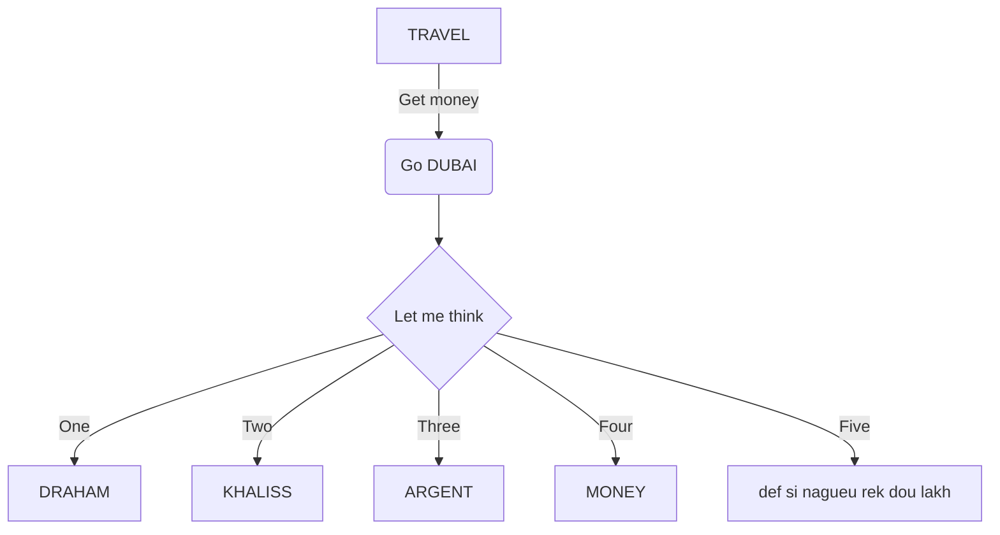

# Atelier-UML

```mermaid
flowchart TD
    A[TRAVEL] -->|Get money| B(Go DUBAI)
    B --> C{Let me think}
    C -->|One| D[DRAHAM]
    C -->|Two| E[KHALISS]
    C -->|Three| F[ARGENT]
    C -->|Four| G[MONEY]
    C -->|Five| H[def si nagueu rek dou lakh]
```
