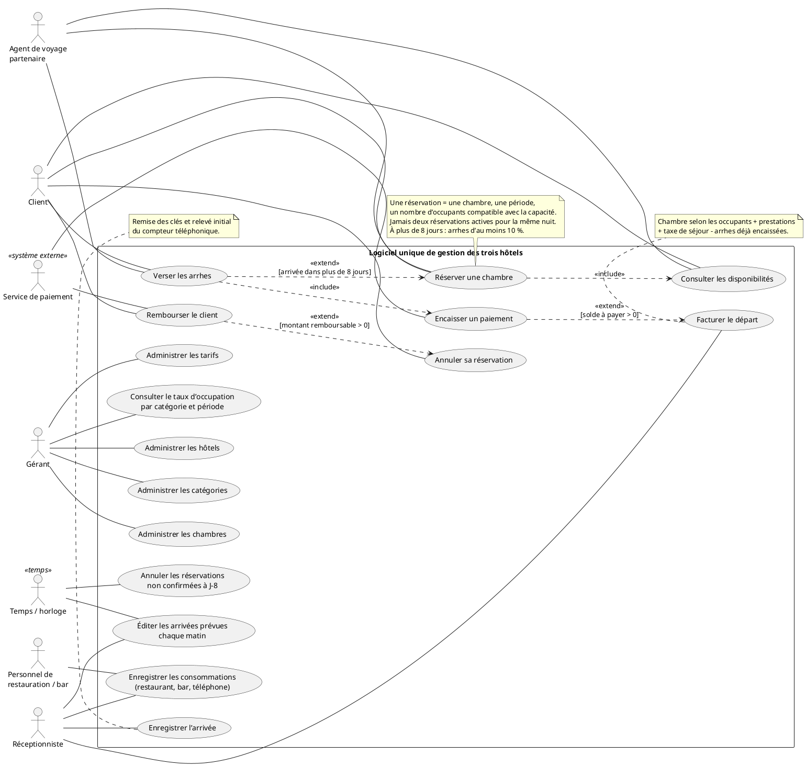

# Atelier UML — Gestion de trois hôtels

Source : énoncé « Atelier UML - Diagramme Use Case », B2 EPSI, 2026-2027.

Le système couvre les réservations, les séjours, la facturation et l’administration des trois hôtels de la PME, de 30 à 80 chambres chacun, avec leurs catégories de chambres et leur restaurant.

## 1. Acteurs

| Acteur | Nature | Attente ou interaction |
| --- | --- | --- |
| Client | Humain | Consulter les disponibilités, réserver, verser des arrhes, annuler sa réservation et obtenir le remboursement applicable. |
| Agent de voyage partenaire | Humain | Consulter les disponibilités et réserver pour le compte d’un client identifié, avec les arrhes requises. |
| Réceptionniste | Humain | Enregistrer l’arrivée, la remise des clés et le compteur téléphonique, saisir des consommations, facturer le départ et consulter les arrivées du jour. |
| Personnel de restauration/bar | Humain | Enregistrer les consommations du restaurant et du bar sur le séjour concerné. |
| Gérant | Humain | Administrer hôtels, catégories, chambres et tarifs ; consulter le taux d’occupation par catégorie sur une période. |
| Service de paiement | Système externe | Traiter les encaissements et, par hypothèse, les remboursements ; retourner leur résultat. |
| Temps / horloge | Temps | Déclencher l’annulation des réservations non confirmées à J-8 et l’édition quotidienne des arrivées prévues. |

**Agent de voyage et client :** ce sont deux acteurs distincts : le client réserve pour lui-même, l’agent agit pour le compte d’un client.
Ils partagent les cas de consultation et de réservation, mais l’agent n’hérite pas du droit d’annulation personnelle du client ; aucune généralisation entre ces acteurs n’est retenue.

## 2. Diagramme de cas d’utilisation

Le bloc suivant est la source PlantUML du diagramme. Les flèches `include` vont vers le comportement systématiquement utilisé ; les flèches `extend` vont du comportement conditionnel vers le cas étendu.

### Règles métier et hypothèses explicites

- Une période est modélisée par `[date d’arrivée, date de départ[` : la nuit du départ n’est pas occupée. Le départ doit être postérieur à l’arrivée.
- Le nombre d’occupants est un entier positif inférieur ou égal à la capacité de la chambre.
- Le contrôle de disponibilité et l’enregistrement sont atomiques : deux demandes concurrentes ne peuvent pas réserver la même chambre pour la même nuit. Une réservation en attente d’arrhes bloque aussi ces nuits jusqu’à son annulation.
- Pour une réservation effectuée **plus de 8 jours** avant l’arrivée, les arrhes exigées sont au minimum de 10 %. Hypothèse de travail : l’assiette est le montant de l’hébergement connu lors de la réservation ; les prestations futures en sont exclues. Le montant définitif de l’assiette reste à valider avec le gérant.
- Hypothèse : une réservation anticipée est confirmée dès que les arrhes exigées sont encaissées. Sinon, elle reste en attente, puis est annulée à J-8. À exactement 8 jours ou moins, l’énoncé n’impose pas d’arrhes : elle est confirmée après validation de sa disponibilité et des informations.
- L’horloge vérifie à J-8 le statut avant d’annuler : une réservation déjà confirmée n’est pas supprimée. Une confirmation de paiement tardive après annulation doit être rapprochée et traitée sans recréer une réservation en conflit.
- Le remboursement d’une annulation dépend du délai. Aucun taux ni seuil n’est inventé : le barème doit être fourni par le gérant. Son calcul est interne au cas d’annulation ; son exécution conditionnelle est un `extend`.
- Le service externe assure aussi les remboursements par hypothèse. Le personnel de restauration/bar saisit ses consommations ; la réception saisit le téléphone. Ces responsabilités sont des choix de modélisation à valider.
- Le taux d’occupation est calculé, sur une période, par catégorie et hôtel : nuits-chambres occupées / nuits-chambres offertes × 100. Une offre nulle donne « non applicable ». Cette définition doit être validée, notamment pour distinguer occupation réalisée et réservation prévisionnelle.
- Le paiement du départ est une extension conditionnelle, car les arrhes peuvent couvrir tout le montant. La remise des clés, le relevé téléphonique et les calculs de facture restent des étapes des cas concernés, sans créer un cas par opération technique.

## 3. Fiches textuelles

- [Réserver une chambre](reserver-chambre.md)
- [Facturer le départ](facturer-depart.md)

## 4. Décision pour la restitution

Nous avons hésité à spécialiser l’agent de voyage à partir du client. Nous retenons deux acteurs distincts associés aux mêmes cas de consultation et de réservation : partager certaines interactions ne signifie pas partager tous les droits. Cela évite de donner implicitement à l’agent le droit d’annuler une réservation à la place du client.
